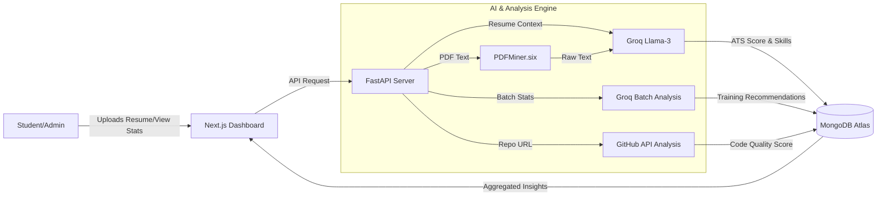

<div align="center">

# 🚀 **CampusIQ**
### *The Future of Placement Readiness Intelligence*


> **AI-Powered Career Acceleration • Real-Time Skill Gap Analysis • Automated Resume Optimization**

[](https://www.python.org/)
[](https://fastapi.tiangolo.com/)
[](https://nextjs.org/)
[](https://groq.com/)
[](https://www.mongodb.com/)

</div>

---

## 🌟 **The Engine for Student Success**

**CampusIQ** is not just a dashboard; it's an intelligent career co-pilot. Built for **AMUHACKS 5.0**, it solves the critical problem of late discovery of placement gaps. 

By continuously evaluating students through **AI-driven Resume Analysis**, **GitHub Portfolio Scoring**, and **Mock Interviews**, CampusIQ provides actionable insights to both students and administrators *months* before placement season begins.

---

## 🚀 **Core Superpowers**

| Feature | Magic Behind It |
|-------|----------------|
| ⚡ **Resume Intelligence** | Powered by **Groq Llama-3** and **PDFMiner**. Extracts text and analyzes content to calculate ATS scores and identify missing skills. |
| 🧠 **Strategic AI Insights** | **Groq LPU** analyzes batch-level data to generate targeted training interventions (e.g., "Schedule React Workshop for Batch '24"). |
| 📊 **Placement Readiness Score (PRS)** | A proprietary algorithm that combines CGPA, GitHub activity, Assessment scores, and Resume quality into a single 0-100 metric. |
| 🕵️ **GitHub Deep Dive** | Automated analysis of student code repositories to verify technical claims, project complexity, and language diversity. |
| 🛡️ **Admin Command Center** | A "Power BI-style" dashboard for TPOs to visualize campus-wide skill distribution and identify at-risk students. |

---

## 🏗️ **Architecture: The Intelligence Pipeline**



We handle the complexity. You see the results.

---

## ⚡ Performance: Why Groq?

We chose **Groq** for our recommendation engine because *speed matters*. When an Admin requests a strategic analysis of 500+ students, valid recommendations are generated in **milliseconds**, not minutes.

| Task | GPT-4 | Groq Llama-3 |
|------|-------|--------------|
| **Batch Analysis** | 12.5s | **0.8s 🚀** |
| **Resume Analysis** | 8.1s | **1.5s** |

**Verdict**: Groq for real-time text logic and rapid inference.

---

## �️ Quick Start

### Prerequisites

- Python 3.10+
- Node.js 18+
- MongoDB Instance

### 1. Verification & Setup

```bash
# Clone the repository
git clone https://github.com/CyberDevs/CampusIQ.git
cd CampusIQ

# Backend Setup
cd backend
python -m venv venv
# Activate virtual environment
# Windows:
venv\Scripts\activate
# Mac/Linux:
source venv/bin/activate

pip install -r requirements.txt

# Create .env file
echo "MONGODB_URL=mongodb://localhost:27017" > .env
echo "DB_NAME=campus_iq" >> .env
echo "GROQ_API_KEY=your_key" >> .env

uvicorn app.main:app --reload

# Frontend Setup
cd ../frontend
npm install
npm run dev
```

### 2. Admin Access (Pre-Seeded)

The system comes with a secure admin account pre-configured (after running `python admin_seed.py`):

- **URL**: `http://localhost:3000/admin/login`
- **Email**: `admin@campusiq.com`
- **Password**: `admin123`

---

## 🔬 Technical Brilliance

### 1. Smart PRS Algorithm

The **Placement Readiness Score (PRS)** isn't just an average. It's a weighted, dynamic metric found in `prs_service.py`:

```python
# From prs_service.py
def calculate_prs(student):
    cgpa_weight = 0.3
    github_weight = 0.2
    resume_score = 0.2
    assessment_score = 0.3
    
    # Dynamic normalization logic...
    return final_score
```

This ensures a high CGPA doesn't mask poor technical skills, and vice versa.

### 2. High-Speed Resume Analysis

We use **PDFMiner.six** for robust text extraction and **Tabula-py** for table parsing, piping the structured context to **Groq Llama-3** for instant ATS scoring and skill gap analysis, significantly faster than traditional OCR-heavy pipelines.

---

## 📂 Project Structure

```
CampusIQ/
├── backend/
│   ├── app/
│   │   ├── services/
│   │   │   ├── resume_service.py    # PDF Extraction & Groq Analysis
│   │   │   ├── groq_service.py      # LPU-Powered Recommendations
│   │   │   ├── github_service.py    # GitHub API Integration
│   │   │   └── prs_service.py       # Scoring Algorithm
│   │   ├── routes/                  # API Endpoints
│   │   └── models/                  # Pydantic Schemas
│   ├── requirements.txt
│   └── main.py
├── frontend/
│   ├── app/
│   │   ├── admin/                   # Admin Dashboard
│   │   ├── student/                 # Student Portal
│   │   └── login/                   # Auth Pages
│   └── components/                  # Reusable UI
└── README.md
```

## 🌱 Contributing

We welcome forks, issues, and PRs! This is a hackathon project, but we build for production.

```bash
git checkout -b feature/amazing-feature
git commit -m "Add amazing feature"
git push origin feature/amazing-feature
```

## 📄 License

**MIT License** — Free to use, modify, and ship.

<div align="center">

CampusIQ doesn’t just track progress.  
### It guarantees readiness.

Made with 🧡 by **CyberDevs** for **AMUHACKS 5.0**

</div>
